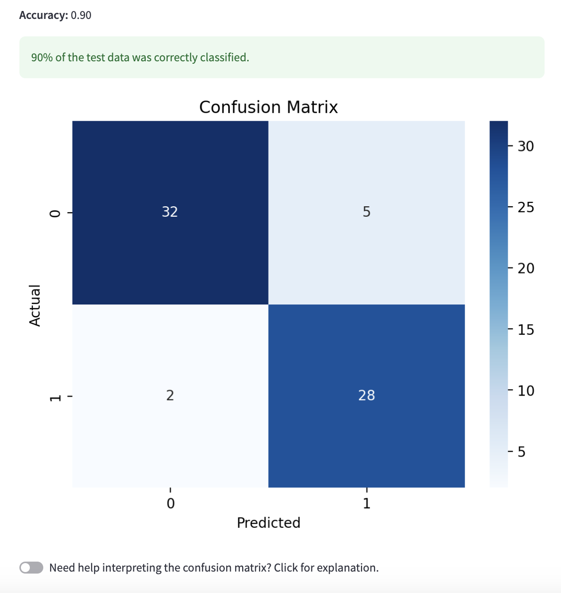
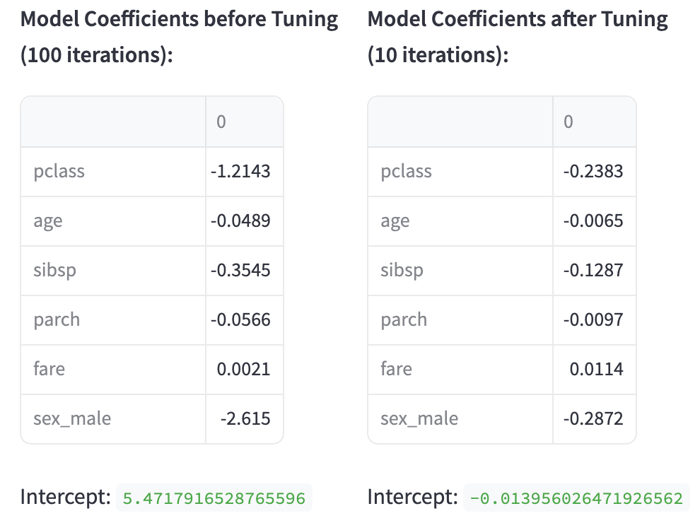

# Supervised Learning via Streamlit

## Project Overview: 
This application provides an interactive walkthrough to training and evaluating a supervised learning model, including data pre-processing, model selection, and parameter tuning. Specifically, this app explores:

- **Logistic Regression:** An algorithm which predicts class by calculating the probability of each binary outcome, as influenced by the included features.
- **'k' Nearest Neighbors:** An algorithm designed to predict class according to a data point's similarity to its 'k' nearest neighbors in the feature space.

Logistic regression and kNN are both commonly used as classification models, however, there are notable differences that can make each model more suitable to given scenarios. This interactive app will allow users to explore datasets, tidy processes, and hyperparameters to evaluate how each model performs in different settings. 

## Table of Contents:
1. [Project Overview](#project-overview)
2. [Usage](#usage)
3. [App Features](#app-features)
4. [References](#references)
5. [Visual Examples](#visual-examples)

## Usage:
To launch via Streamlit cloud:
https://latimer-data-science-portfolio-yatfbhmmaejgkactjbctyf.streamlit.app/

To launch locally:
1. **Clone the Repository:**
   `git clone repository_url`
2. **Install dependencies:** Check the requirements.txt file to ensure the proper dependencies are downloaded.
   `pip install -r requirements.txt`
3. **Navigate to the proper folder:** Open your terminal and move to the directory containing 'MLStreamlitApp'  
   `cd path/to/MLStreamlitApp`
4. **Run using the following command:**  
   `streamlit run Main.py`
5. **Interact with the app:** Explore different datasets, supervised learning models, and tuning parameters using the app features below.
6. **Closing the app:** Kill the terminal in which the command was run to deactivate the app.

## App Features:
**Data Selection:** Using the sidebar, select a sample dataset or upload a CSV of your own.

**Data Processing:** 
- For the sample data: Presets will automatically process the data for a uniform set-up of the sample data.
- For an uploaded CSV: Use the widgets to remove columns of choice, drop observations with missing data, and encode categorical variables.

**Model and Variable Selection:** Select a supervised learning model (logistic regression or 'k' nearest neighbors).
- For the sample data: Target variable (y) and features (X) are specified.
- For tan uploaded CSV: Use the instructions and provided widgets to select suitable a suitable target (y) and features (X).
    
**Model Training and Testing:**
- Confirm that data was split into training and test subsets.
- Choose whether or not to scale the data.
- View performance metrics (accuracy and confusion matrix) according to model and scaling selections.

**Hyperparameter Tuning:** Use the selectebox to choose a hyperparameter and explore its effects on the performance metrics.
- Logistic Regression:
  - Use the selectbox to choose a penalty to apply. 
  - Input a number to set the maximum number of iterations.
- 'k' Nearest Neighbors:
  - Adjust 'k' neighbors on the provided slider.
  - Use the selectbox to choose a distance metric.

## References:
**Data:** [Seaborn's Penguin Data](https://www.kaggle.com/code/tirendazacademy/penguin-dataset-data-visualization-with-seaborn), [Seaborn's Titanic Data](https://www.kaggle.com/code/roblexnana/data-viz-tutorial-with-titanic-and-seaborn)

**Streamlit:** [Streamlit API Cheat Sheet](https://docs.streamlit.io/develop/quick-reference/cheat-sheet), [Streamlit Cloud](https://docs.streamlit.io/deploy/streamlit-community-cloud/deploy-your-app)

**Logistic Regression:** [SciKit-Learn Documentation](https://scikit-learn.org/stable/modules/generated/sklearn.linear_model.LogisticRegression.html), [Penalty Types](https://www.statisticshowto.com/regularization/)

**kNN:** [SkiKit-Learn Documentation](https://scikit-learn.org/stable/modules/generated/sklearn.neighbors.KNeighborsClassifier.html), [Understanding Distance Metric](https://www.geeksforgeeks.org/how-to-choose-the-right-distance-metric-in-knn/)

## Visual Examples:
The app should produce the following confusion matrices and tables:

