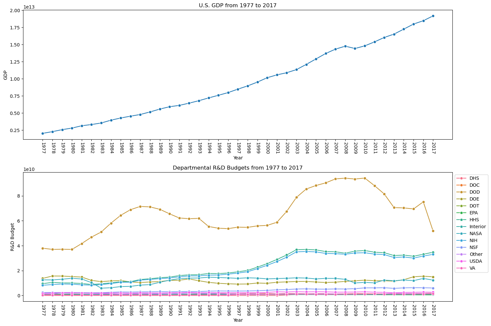
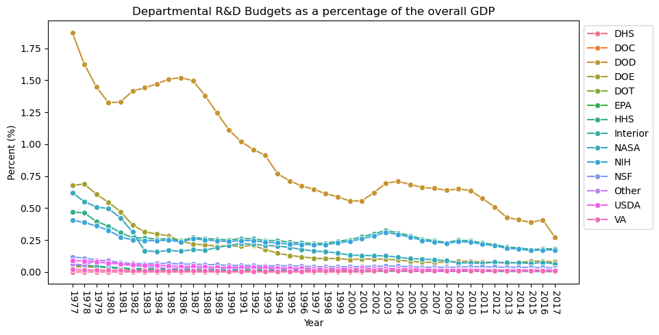

# Principles of Tidy Data

## Project Overview: 
**Goal:** Utilize tidy data principles during the data cleaning processes to produce data sets that are readily able to be visualized and manipulated. 

**Purpose:** Much of the data analysis process is spent in the cleaning stages, as it neccessary to ensure that the data can be further tested and analyzed. Thus, it is important that cleaning techniques are done as effectively and efficiently as possible to make for smoother analysis down the road. Tidy data approaches, like the ones explored in this project, ensure that this process is completed. 

## Usage:
1. **Esnure the proper requirements are installed:**
- Python (version 3.12 or greater recommended)
- A system capable of running Jupyter Notebook (e.g. Jupyter Lab, VS Code, or a cloud environment like Google Colab)
- The required Python libraries (i.e. pandas, seaborn, matplotlib.pyplot)
  
2. **Clone the repository:**  
   `git clone https://github.com/llatimer031/Latimer-Data-Science-Portfolio/tree/main/TidyData-Project`
   
3. **Open and run the Jupyter Notebook:**
- Load the system of your choosing and navigate to the cloned repository. 
- Open the main.ipynb file.
- Run sequentially.

## Features:
**Data Cleaning:** 
- Explains violations to TidyData principles.
- Explores solutions, including `pd.melt()` and `.str.split()` functions.

**Visualizations:** Produces the graphs found in the [Visual Examples](##visual-examples) section. 

**Pivot Tables:** Demonstrates how the data can be aggregated by different indexes to show summary statistics for a specified value. 

## References: 
**Data:** [TidyTuesday Federal Research and Discovery Repository](https://github.com/rfordatascience/tidytuesday/tree/main/data/2019/2019-02-12), [Modified Data](https://github.com/llatimer031/Latimer-Data-Science-Portfolio/blob/main/TidyData-Project/data/fed_rd_year%26gdp.csv)

**Tidy Data Principles:** [Outline of TidyData Principles](https://vita.had.co.nz/papers/tidy-data.pdf), [Pandas Cheat Sheet](https://pandas.pydata.org/Pandas_Cheat_Sheet.pdf).

## Visual Examples:

