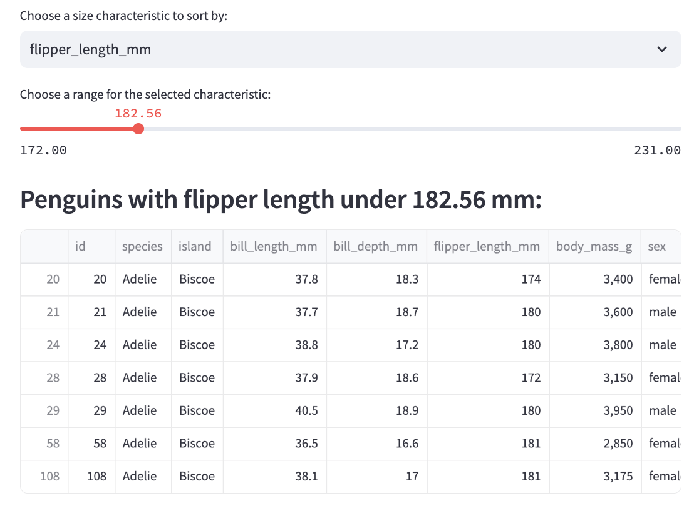

# Basic Streamlit App 

## Project Overview:
This project creates a basic Streamlit app which focuses on the use of interactive widgets to explore and subset a simple dataset (Palmer's Penguins).

## Table of Contents:
1. [Project Overview](#project-overview)
2. [Usage](#usage)
3. [App Features](#app-features)
4. [References](#references)
5. [Visual Examples](#visual-examples)
   
## Usage:
Follow these steps to use the Streamlit app:
1. **Clone the repository:**
   `git clone repository_url`
2. **Install dependencies:** Check the requirements.txt file to ensure the proper dependencies are downloaded.
   `pip install streamlit pandas`
3. **Navigate to the proper folder:** Open your terminal and move to the directory containing 'basic_streamlit_app'  
   `cd path/to/basic_streamlit_app`
4. **Launch the interface using the following command:**  
   `streamlit run basic_streamlit_app/main.py`
5. **Interact with the app:** The app will open in a separate web browser. Use the provided widgets to indicate preferences regarding location, species, and size. View a subset of the data with the specified characteristics. Adjust your selections at any point to produce a different subset.
6. **Closing the app:** Close (or kill) the terminal in which the command was run to deactivate the app. 

## App Features:
**Island Selection:** Use the selectbox to choose an island to explore.

**Species Sorting:** Decide whether or not to sort by species, and then use the selectbox to choose a species to explore. 

**Characterize by Size:** 
- Use the selectbox to choose between all size characteristic columns.
- Pick a value on the slider to set the range for the chosen characteristic.

**View the Subset:** Use the provided dataframe to view the subset of data containing the selected characteristics above. 

## References:
**Data:** [Palmer's Penguins CSV](https://github.com/llatimer031/Latimer-Data-Science-Portfolio/blob/main/basic-streamlit-app/data/penguins.csv)

**Streamlit:** [Streamlit API Cheat Sheet](https://docs.streamlit.io/develop/quick-reference/cheat-sheet)

## Visual Examples:

